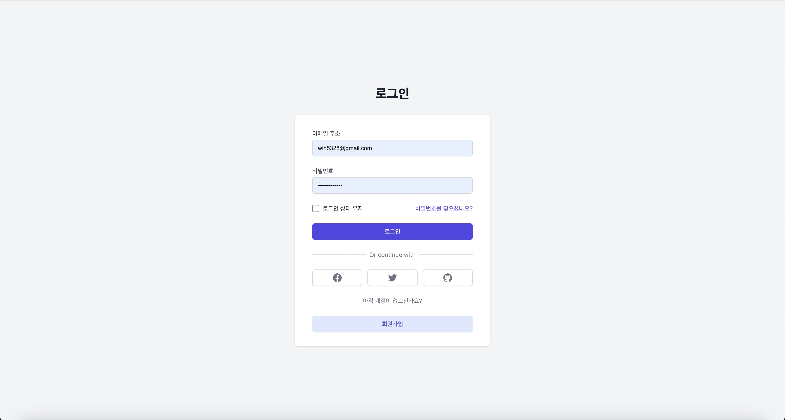

cat > README.md << 'EOL'
# 취뽀의정석 (Portfolio Hub for Students)

  

## 📚 프로젝트 소개

취뽀의정석은 대학생들이 자신의 포트폴리오를 공유하고, 다른 학생들의 작품을 발견할 수 있는 플랫폼입니다. 
취업을 준비하는 학생들에게 영감을 주고, 서로의 성장을 돕는 커뮤니티를 만들어갑니다.

### 🎯 주요 기능

- **포트폴리오 공유**: 자신의 프로젝트와 작품을 쉽게 업로드하고 공유
- **카테고리별 탐색**: 디자인, 개발, 마케팅 등 다양한 분야별 포트폴리오 탐색
- **인터랙티브 피드백**: 댓글과 좋아요를 통한 커뮤니티 피드백
- **프로필 관리**: 개인 프로필을 통한 작품 모음 관리

## 🛠 기술 스택

### Frontend
- React.js
- Tailwind CSS
- React Router
- Lucide Icons

### Backend (예정)
- Node.js
- Express
- Firebase

## 🚀 시작하기

\`\`\`bash
# 저장소 클론
git clone https://github.com/yourusername/portfolio-hub.git

# 디렉토리 이동
cd portfolio-hub

# 의존성 설치
npm install

# 개발 서버 실행
npm start
\`\`\`

## 📱 스크린샷

  
  
  
  

## 🎨 주요 특징

- **직관적인 UI/UX**: 사용자 친화적인 인터페이스로 쉽게 포트폴리오 관리
- **반응형 디자인**: 사용자들의 포트폴리오를 공유할 수 있는 플랫폼
- **실시간 업데이트**: 최신 포트폴리오와 피드백 실시간 반영
- **검색 최적화**: 태그와 카테고리를 통한 효율적인 포트폴리오 검색

## 🌟 로드맵
- [x] 레포 만들고 공동 작업장 셋팅
- [x] 프론트 엔드 화면 개발 (메인 화면, 로그인 화면)
- [x] 프론트 엔드 화면 개발 (업로드, 포트폴리오 상세 화면)
- [x] 포트폴리오 외부 공유 기능
- [x] 포트폴리오 업로드 기능
- [x] 포트폴리오 검색 기능
- [x] 사용자 인증 시스템 구현 (로그인, 회원가입)
- [x] 실시간 알림 기능 (좋아요, 댓글) - 김현규

## 👥 팀원
- 신동우 (조장)
- 김현규 (조원)
- 양해솔 (조원)
- 홍성인 (조원)

## 📞 연락
- 이메일 : na5328@naver.com
- 전화번호 : 010-6522-5079

